# ADNI Plasma Biomarker AD Classifier — Research Analysis Visual Guide

> **Purpose:** Research-grade interpretation and documentation of the statistical-analysis figures generated from the ADNI plasma biomarker project.
>
> **Audience:** Medical students, biomedical researchers, clinical collaborators, ML/engineering reviewers, and anyone reading the project on GitHub.
>
> **Dataset:** ADNI `Final_Biomarker_Patients` — 889 patients, one row per patient, using real data only.
>
> **Latest analysis pipeline:** `python3 run_analysis.py`
>
> **Important:** These figures describe associations and model behavior in the analyzed ADNI cohort. They do **not** establish causation, prognosis, or independent clinical validity outside the evaluated data.

---

## 1. Project context

The project uses plasma biomarkers to study and classify diagnostic status across **Control, MCI, and Dementia**. The core biomarkers are **pTau-217, Amyloid-β42 (AB42), Amyloid-β40 (AB40), NfL, and GFAP**. NfL and GFAP are available across Fujirebio and Quanterix assay platforms and are harmonized before modeling. The project also engineers clinically motivated ratios, log transforms, percentile ranks, and interaction terms.

The current finalized analysis contains:

- **889 patients** total
- **343 Control**, **315 MCI**, **231 Dementia**
- **Binary task:** Control vs Dementia
- **3-class task:** Control vs MCI vs Dementia
- Full data-quality, descriptive, correlation, statistical, regression, classification, feature-importance, PCA, outlier, and leakage analyses
- **101 generated analysis files** including figures, tables, JSON summary, and report

The latest finalized binary model is a **Random Forest**. Its held-out test-set performance is **87.4% accuracy**, **ROC-AUC 0.956**, and **PR-AUC 0.935**. The 3-class reference model achieves **61.2% accuracy**, with **MCI recall 38.3%**. These results are test-set observations from the ADNI cohort, not external clinical validation.

---

## 2. How to read this document

For every figure, use four questions:

1. **What is being plotted?**
2. **What does the visual pattern mean?**
3. **What does it mean in this dataset?**
4. **Why is it useful for research?**

A recurring rule throughout the project is:

> **Association or statistical significance does not imply causation.**

Another important rule is:

> **Model feature importance describes model behavior; it is not proof of biological causality.**

---

# 3. Pairwise Biomarker Comparisons

## 3.1 What is a pairwise biomarker ratio?

A pairwise ratio compares one biomarker relative to another:

\[
\text{Ratio} = \frac{\text{Biomarker A}}{\text{Biomarker B}}
\]

These plots are **dataset-level descriptive comparisons** between Control and Dementia. They are not individual-patient diagnostic thresholds.

---

### Figure: pTau-217 ÷ Amyloid-β42

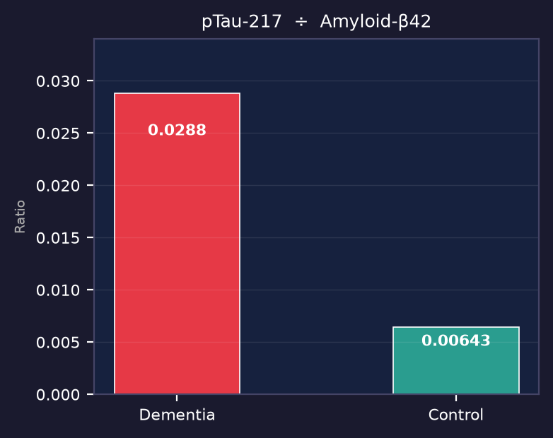

**Observed group means:**

- Dementia: **0.0288**
- Control: **0.00643**
- Approximate group ratio: **4.48×** higher in Dementia

**Interpretation:** The pTau-217 signal is much larger relative to AB42 in the Dementia group. The strong separation is driven largely by the strong increase in pTau-217, while raw AB42 shows relatively little group separation.

**Research value:** Shows why a relative biomarker relationship can sometimes separate groups more clearly than either raw biomarker alone.

---

### Figure: pTau-217 ÷ Amyloid-β40

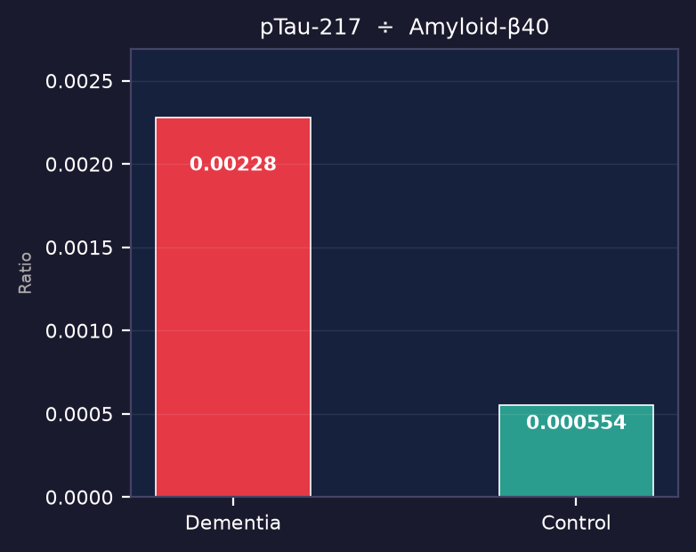

**Observed group means:**

- Dementia: **0.00228**
- Control: **0.000554**
- Approximate group ratio: **4.12×** higher in Dementia

**Interpretation:** AB40 changes only slightly between the groups, while pTau-217 increases substantially. Consequently, the pTau/AB40 relationship is much higher in Dementia.

**Research value:** Demonstrates the relative dominance of pTau-217 in the biomarker panel.

---

### Figure: pTau-217 ÷ NfL

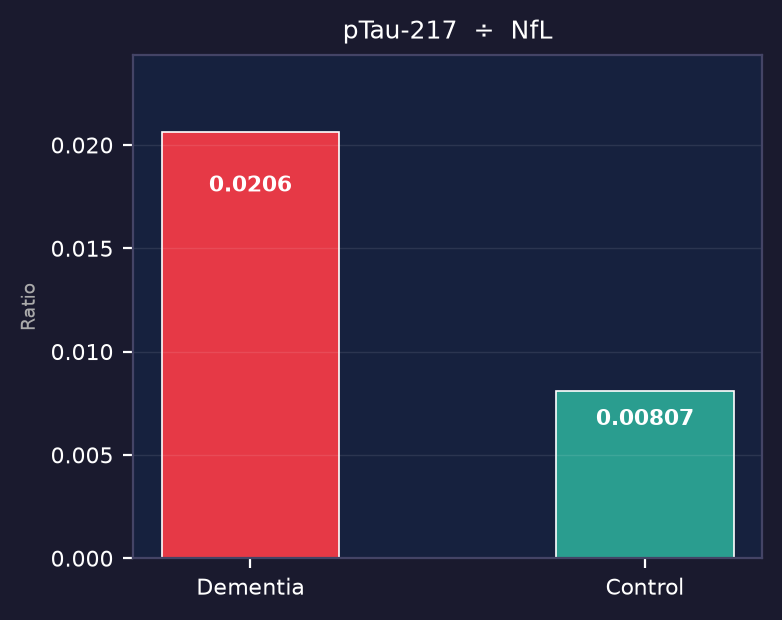

**Observed group means:**

- Dementia: **0.0206**
- Control: **0.00807**
- Approximate group ratio: **2.55×** higher in Dementia

**Interpretation:** Both pTau-217 and NfL increase in Dementia, but pTau-217 increases proportionally more, so their ratio also increases.

**Research value:** Helps illustrate how relative changes between two disease-related signals can provide a different view from absolute biomarker concentrations.

---

### Figure: pTau-217 ÷ GFAP

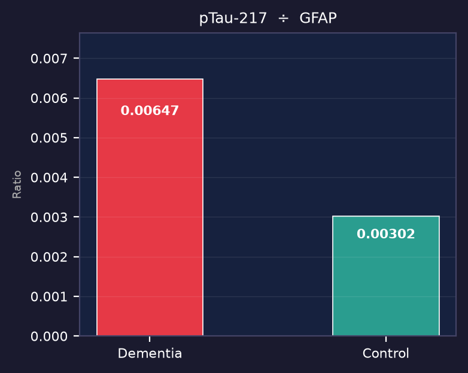

**Observed group means:**

- Dementia: **0.00647**
- Control: **0.00302**
- Approximate group ratio: **2.14×** higher in Dementia

**Interpretation:** GFAP also increases in Dementia, but the relative rise in pTau-217 remains larger.

**Research value:** Shows how tau-related and astroglial signals relate at a group level.

---

### Pairwise comparison takeaway

Across these examples, **pTau-217-based ratios are consistently higher in Dementia**. This is consistent with the broader analysis in which pTau-217 shows the strongest biomarker-level association with diagnostic status.

---

# 4. Classification Performance

## 4.1 Binary model: Control vs Dementia

The binary model is evaluated on a held-out test set of **87 patients: 52 Control and 35 Dementia**.

Key final metrics:

| Metric | Value |
|---|---:|
| Accuracy | **87.4%** |
| Balanced Accuracy | 87.1% |
| Dementia Sensitivity / Recall | **85.7%** |
| Specificity | 88.5% |
| Dementia Precision | 83.3% |
| ROC-AUC | **0.956** |
| PR-AUC | **0.935** |
| MCC | 0.739 |
| Brier Score | 0.088 |

---

## 4.2 ROC Curve — Binary Model

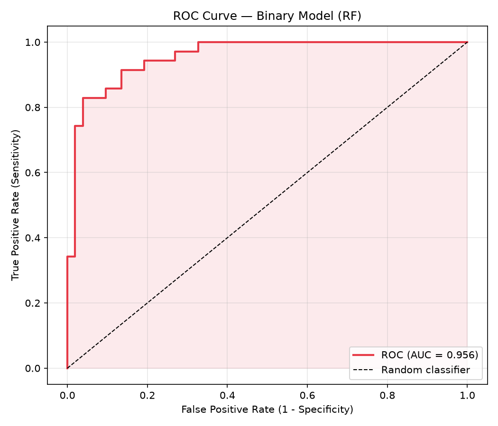

### What is ROC?

The ROC curve examines performance across different probability thresholds.

- **X-axis:** False Positive Rate = proportion of Control patients incorrectly classified as Dementia
- **Y-axis:** True Positive Rate = Sensitivity = proportion of Dementia patients correctly identified

The diagonal dashed line represents a random classifier.

### Result

**ROC-AUC = 0.956.**

AUC summarizes how well the model separates the two groups across thresholds. It is **not the same as accuracy**.

### Research interpretation

The curve stays well above the random baseline and close to the upper-left region for much of its range, indicating strong discrimination on this held-out ADNI test set.

---

## 4.3 Precision–Recall Curve — Binary Model

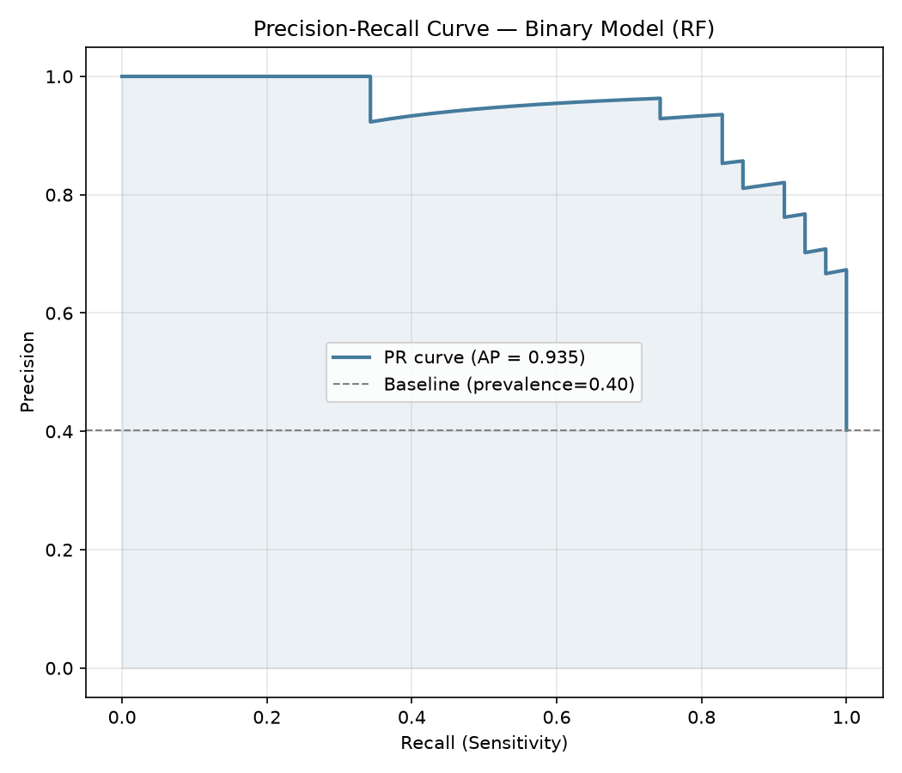

### What is precision?

Among patients predicted as Dementia, how many were actually Dementia?

### What is recall?

Among patients who truly had Dementia, how many did the model identify?

### Result

**Average Precision (AP) = 0.935.**

The dashed baseline is approximately the positive-class prevalence in the test set (~0.40).

### Research interpretation

The model maintains high precision across a large part of the recall range and performs substantially above the prevalence baseline.

---

## 4.4 Confusion Matrix — Binary Model

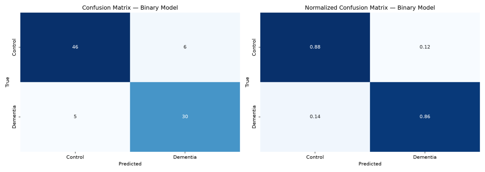

The raw confusion matrix is:

| | Predicted Control | Predicted Dementia |
|---|---:|---:|
| **True Control** | **46 (TN)** | **6 (FP)** |
| **True Dementia** | **5 (FN)** | **30 (TP)** |

### Clinical meaning of the four cells

- **TN:** Control correctly identified as Control
- **FP:** Control incorrectly flagged as Dementia
- **FN:** Dementia incorrectly classified as Control
- **TP:** Dementia correctly identified as Dementia

From these counts:

- Sensitivity = 30 / 35 = **85.7%**
- Specificity = 46 / 52 = **88.5%**
- Precision = 30 / 36 = **83.3%**

This figure is often the easiest way for a medical audience to understand the practical behavior of the model.

---

## 4.5 Threshold Analysis

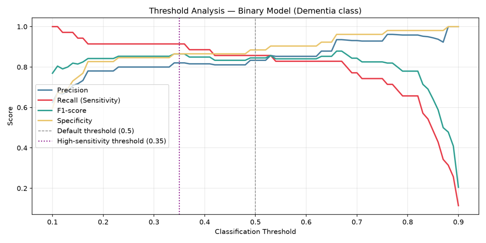

A model first produces a probability such as `P(Dementia) = 0.72`. A **threshold** determines when that probability becomes a Dementia prediction.

### Default threshold = 0.50

- Probability ≥ 0.50 → Dementia
- Probability < 0.50 → Control

At this operating point, the final analysis reports approximately:

- Precision = **0.833**
- Recall = **0.857**

### Lower threshold = 0.35

At a lower threshold, the model is more willing to flag a patient as Dementia.

This generally increases sensitivity but can also increase false positives.

The final analysis shows recall rising to approximately **0.886** around this operating point, with a precision trade-off.

### Research value

A threshold is not a property of the disease. It is a **decision rule chosen for a particular use case**. Lower thresholds may be more appropriate for a screening context where missing a true Dementia case is especially costly; higher thresholds may be preferred when false positives are more costly.

---

## 4.6 Calibration Curve

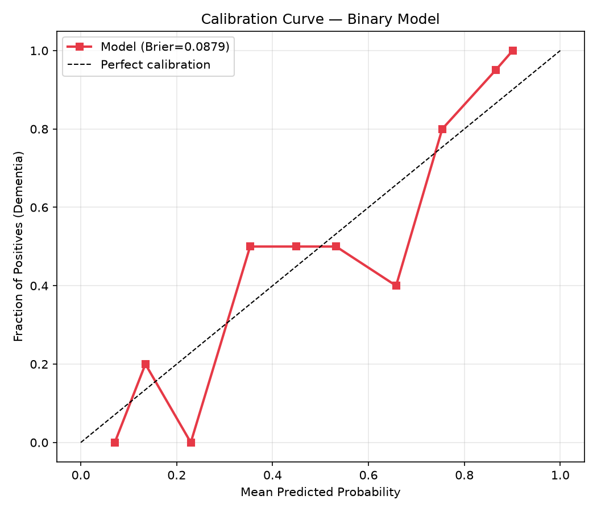

Calibration asks:

> When the model says a group of patients has an average Dementia probability of 0.70, is the observed Dementia proportion approximately 0.70?

- Diagonal dashed line = perfect calibration
- Model points = observed calibration behavior

The model's **Brier Score is 0.0879** in the final analysis. Lower Brier scores indicate smaller probabilistic error, with zero being perfect.

The curve is not perfectly diagonal, so probability estimates should not be treated as clinically definitive. The binary test set is also modest in size (**n=87**), which makes calibration estimates less stable.

---

## 4.7 Predicted Probability Distribution

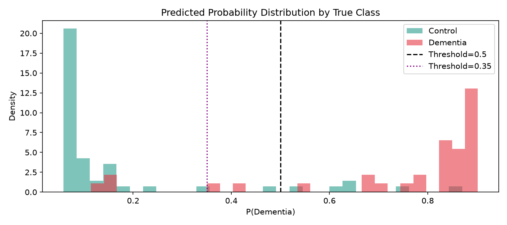

This plot shows the distribution of predicted Dementia probabilities for the two true groups.

- Control probabilities are concentrated toward the lower end.
- Dementia probabilities are concentrated toward the higher end.
- The overlap region represents patients whose predicted probabilities are less clearly separated.

### Research value

This provides an intuitive visual explanation for the high ROC-AUC: the two groups occupy substantially different probability regions, but the separation is not perfect.

---

# 5. 3-Class Classification

## 5.1 ROC Curves — One-vs-Rest


The 3-class model evaluates each diagnosis against the other two:

| Class | One-vs-Rest AUC |
|---|---:|
| Control | **0.818** |
| MCI | **0.612** |
| Dementia | **0.857** |

The MCI curve is much closer to the random baseline than the Control and Dementia curves.

### Main interpretation

The model can separate Control and Dementia more clearly than it can isolate MCI.

This is one of the central findings of the project: **the difficult classification boundary is MCI**.

> A duplicate upload of this same figure was received during documentation. The duplicate is retained in the image folder for provenance.

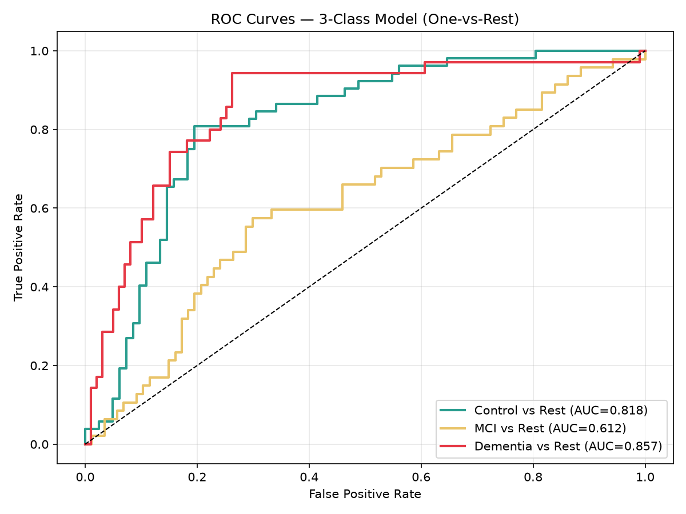

---

## 5.2 3-Class Confusion Matrix

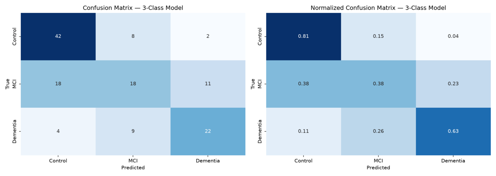

The test set contains **134 patients**.

Raw confusion matrix:

| True \ Predicted | Control | MCI | Dementia |
|---|---:|---:|---:|
| **Control** | **42** | 8 | 2 |
| **MCI** | 18 | **18** | 11 |
| **Dementia** | 4 | 9 | **22** |

Per-class recall:

- Control: **80.8%**
- MCI: **38.3%**
- Dementia: **62.9%**

### Medical interpretation

The MCI row is spread across all three prediction categories. This means many MCI patients are being classified as either Control or Dementia rather than consistently being recognized as MCI.

This is why the 3-class accuracy (61.2%) is substantially lower than the binary Control-vs-Dementia performance.

---

# 6. Nine-Model Binary Bake-off

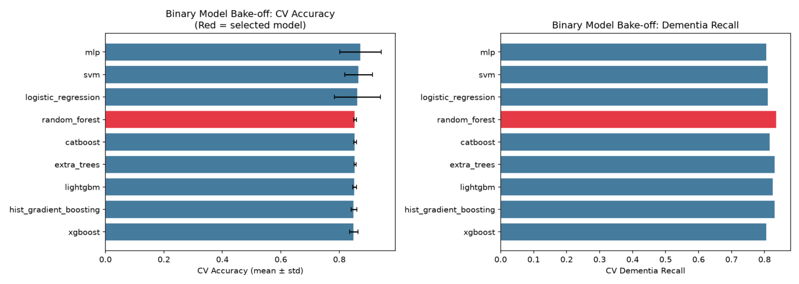

Nine model families were benchmarked using 5-fold cross-validation on the development pool.

The final comparison considered both:

- mean CV accuracy
- fold-to-fold variability
- Dementia recall

The Random Forest was selected in the finalized binary pipeline because it showed **low fold-to-fold variability (~±0.004)** while maintaining strong Dementia recall (~0.837 in CV).

### Important interpretation

The model with the highest average CV accuracy is not automatically the safest model for this dataset. A model with high average performance but large fold-to-fold variation may be less stable.

This section therefore documents **model-selection reasoning**, not simply a race for the largest average number.

---

# 7. Correlation Analysis

## 7.1 What is correlation?

Correlation measures the degree to which two variables tend to change together.

- `+1` → strong positive relationship
- `0` → little linear/rank relationship
- `-1` → strong negative relationship

Correlation is an **association measure**. It does not establish causation.

---

## 7.2 Pearson Correlation Matrix

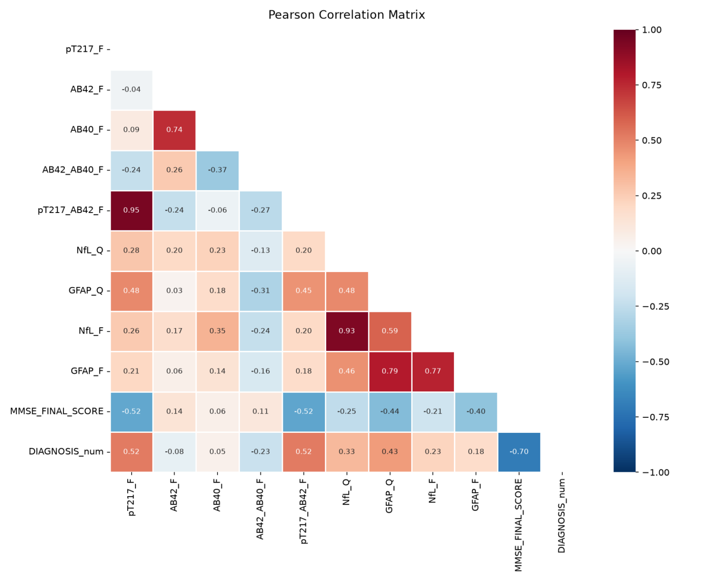

Pearson correlation measures **linear association** between numerical variables.

Important relationships in this dataset include:

| Pair | Pearson r | Interpretation |
|---|---:|---|
| pT217_F ↔ pT217_AB42_F | **0.952** | Ratio is derived from pTau-217, so very high correlation is expected |
| NfL_Q ↔ NfL_F | **0.934** | Same analyte measured on different platforms |
| GFAP_Q ↔ GFAP_F | **0.793** | Same analyte across platforms |
| NfL_F ↔ GFAP_F | **0.770** | Related neurodegeneration/astroglial signals |
| AB42_F ↔ AB40_F | **0.742** | Related amyloid peptides |

### Important warning

The 0.952 pTau/ratio relationship should not be interpreted as two independent biological biomarkers because the ratio itself contains pTau-217.

---

## 7.3 Spearman Correlation Matrix

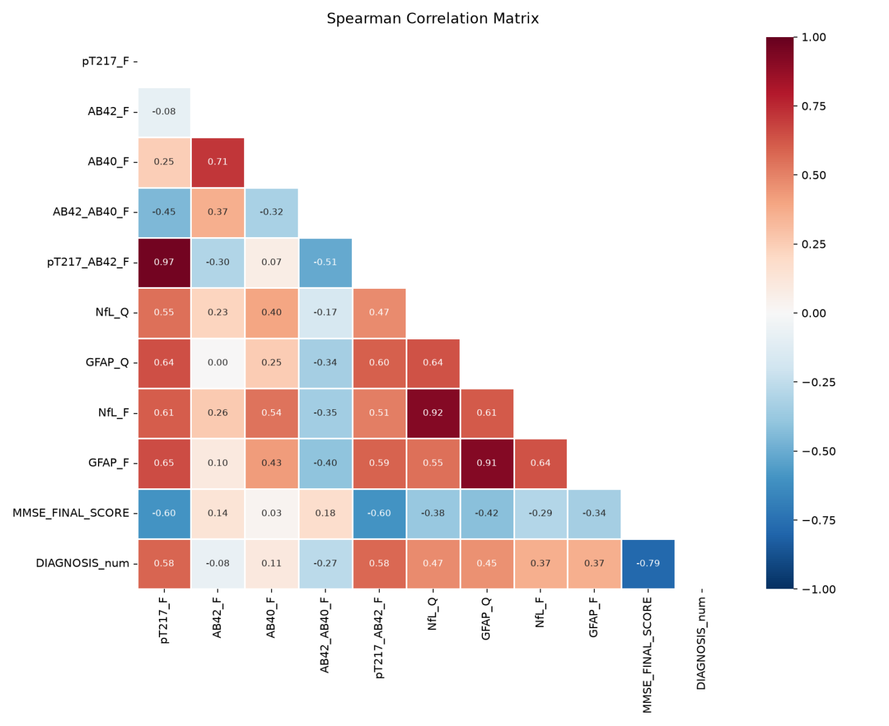

Spearman correlation is based on **rank ordering** and is useful when relationships are monotonic but not necessarily linear, especially with skewed biomarker distributions.

Key feature–diagnosis relationships include:

- pTau-217: **+0.585**
- pTau217/AB42: **+0.577**
- NfL_Q: **+0.474**
- GFAP_Q: **+0.455**
- GFAP_F: **+0.367**
- NfL_F: **+0.365**
- AB42/AB40: **−0.266**
- AB40: **+0.107**
- AB42: **−0.078**
- MMSE: **−0.786**

The MMSE relationship is intentionally excluded from the primary plasma-biomarker model because MMSE is part of the diagnostic workflow and has informative missingness.

---

## 7.4 Kendall Correlation Matrix

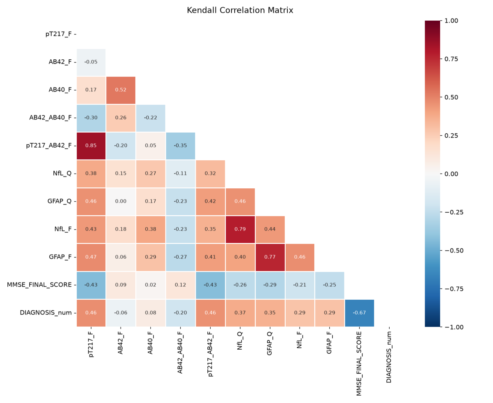

Kendall correlation is another rank-based measure based on the concordance of variable ordering.

The purpose here is **cross-checking**: if Pearson, Spearman, and Kendall all show the same broad direction, the association is less likely to be an artifact of one particular correlation definition.

For pTau-217 and diagnosis, all three measures are positive, supporting the same directional relationship.

---

## 7.5 Feature–Target Correlation Ranking

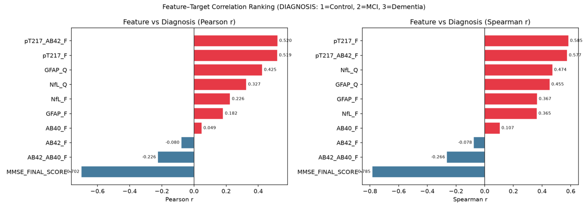

This figure directly ranks variables by their association with `DIAGNOSIS` (coded Control=1, MCI=2, Dementia=3).

### Main biomarker finding

**pTau-217 is the strongest biomarker-level association** in the project:

- Pearson ≈ **+0.519**
- Spearman ≈ **+0.585**

The strongest negative feature is MMSE, which is not part of the primary biomarker-only model.

### Research interpretation

This plot is descriptive. It helps identify promising variables for further analysis but does not prove that one feature causes another.

---

# 8. Statistical Tests

## 8.1 Kruskal-Wallis H Test and Effect Size

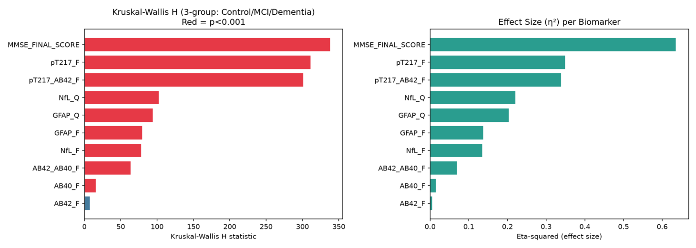

### What does the Kruskal-Wallis test ask?

It compares **three or more independent groups**. Here the groups are:

- Control
- MCI
- Dementia

The biomarker distributions were heavily skewed/non-normal, so a non-parametric group-comparison method was used.

### Important results

| Feature | Kruskal-Wallis H | η² |
|---|---:|---:|
| pT217_F | **311.7** | **0.350** |
| pT217_AB42_F | **301.6** | **0.339** |
| NfL_Q | 102.6 | 0.221 |
| GFAP_Q | 94.8 | 0.204 |
| GFAP_F | 79.8 | 0.138 |
| NfL_F | 78.8 | 0.136 |
| AB42/AB40 | 64.1 | 0.070 |
| AB40 | 16.1 | 0.016 |
| AB42 | 7.8 | 0.007 |

Most features show very small p-values; AB42 is the weakest group-separation result.

### What is η²?

Eta-squared is an **effect-size measure**. It describes how much of the variation in the analyzed outcome is associated with group membership in this test framework.

A large p-value question and a large effect-size question are different:

- **p-value:** Is the observed difference statistically detectable?
- **η²:** How substantial is the group effect?

---

## 8.2 Cohen's d and Fold Change — Control vs Dementia

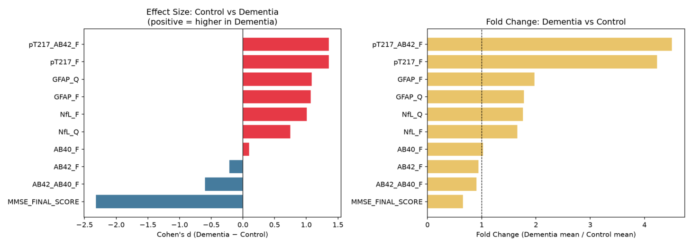

This figure focuses on the clinically relevant pairwise comparison of Control vs Dementia.

### Cohen's d

Cohen's d expresses the standardized difference between the two group means.

Key results:

- pTau-217: **d = 1.36**
- pTau217/AB42: **d = 1.36**
- GFAP_Q: **d = 1.09**
- GFAP_F: **d = 1.07**
- NfL_F: **d = 1.01**
- NfL_Q: **d = 0.75**
- AB42/AB40: **d = −0.60**
- AB40: **d = 0.10**
- AB42: **d = −0.22**

The sign indicates direction: positive means the Dementia group has a higher mean than Control; negative means lower.

### Fold change

\[
\text{Fold change} = \frac{\text{Dementia mean}}{\text{Control mean}}
\]

Selected results:

- pTau-217: **4.24×**
- pTau217/AB42: **4.51×**
- GFAP_F: **1.98×**
- GFAP_Q: **1.79×**
- NfL_F: **1.66×**
- NfL_Q: **1.77×**
- AB40: **1.03×**
- AB42: **0.95×**

This is a clear demonstration of why pTau-217 separates the groups more strongly than raw AB42 or AB40 in this dataset.

---

## 8.3 Statistical Test Results Table

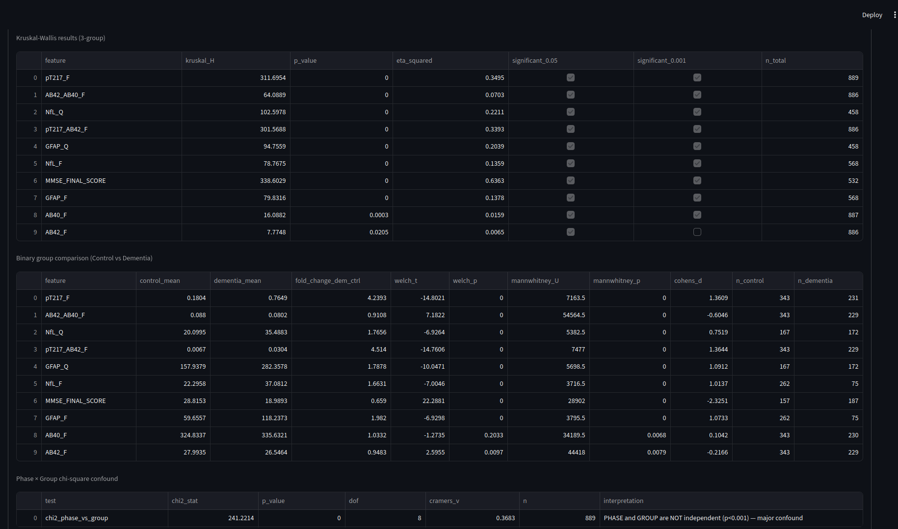

The table view provides the exact statistical values behind the plots, including:

- Kruskal-Wallis H statistic
- p-value
- η²
- Control mean
- Dementia mean
- fold change
- Mann-Whitney U
- pairwise p-value
- Cohen's d
- sample sizes

It also includes the **PHASE × GROUP chi-square analysis**.

### Phase × Group finding

- χ² = **241.2**
- df = 8
- p ≈ **1.3 × 10⁻⁴⁷**
- Cramér's V = **0.3683**

This means PHASE and diagnostic GROUP are strongly associated in the analyzed dataset. This matters because platform availability and ADNI phase are intertwined, creating a potential cohort/design confound. PHASE and platform-count variables are therefore excluded from the default predictive feature set.

---

## 8.4 MMSE Distribution and Missingness

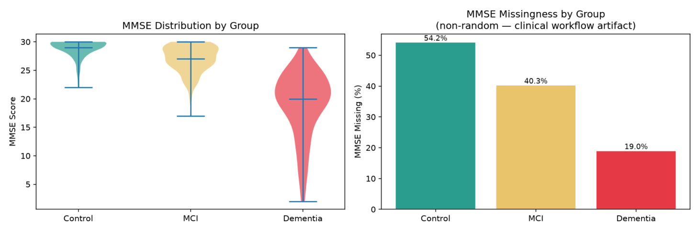

MMSE is a cognitive assessment rather than a plasma biomarker.

### Group distributions

- Control mean ≈ **28.82**
- MCI mean ≈ **26.27**
- Dementia mean ≈ **20.72**

### Missingness

- Control: **54.2% missing**
- MCI: **40.3% missing**
- Dementia: **18.2% missing**

### Why this matters

MMSE is highly associated with diagnostic status, but it is also part of the diagnostic workflow. Using it in the primary plasma-only classifier could make the model partly circular. The diagnosis-dependent missingness also means that missingness itself can carry information unrelated to plasma biology.

---

# 9. Regression Analysis — pTau-217 as Outcome

## 9.1 What is being predicted?

The regression analysis uses:

**Outcome:** pTau-217 concentration

**Predictors:** AB42, AB40, AB42/AB40 ratio, NfL_harmonized, GFAP_harmonized

This is different from the classification problem. It is asking:

> **How much can the other biomarkers explain the variation observed in pTau-217?**

---

## 9.2 OLS Regression Diagnostics

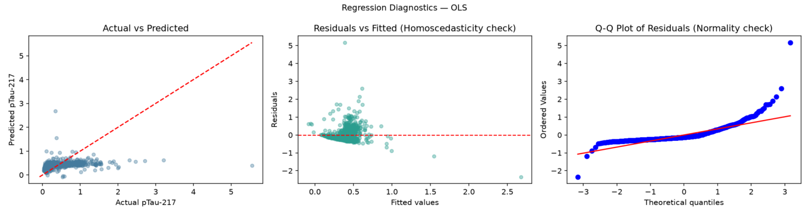

The figure contains three diagnostic panels.

### A. Actual vs Predicted

- X-axis = observed pTau-217
- Y-axis = predicted pTau-217
- diagonal line = perfect prediction

The points are widely scattered, especially for larger pTau values, showing that the linear model does not explain the full range of pTau-217 values.

### B. Residuals vs Fitted

Residual:

\[
\text{Residual} = \text{Actual} - \text{Predicted}
\]

An ideal residual plot would show a fairly uniform random cloud around zero. The observed spread changes with fitted value, indicating **heteroscedasticity**.

### C. Q-Q Plot

The Q-Q plot checks whether residuals approximately follow a normal distribution. The large departures in the tails indicate **non-normal residual behavior**.

### Research interpretation

OLS is statistically informative here, but its assumptions are not fully satisfied. The final report therefore treats the regression coefficients cautiously rather than treating them as a perfect mechanistic model.

---

## 9.3 Regression Model Comparison — 5-fold CV

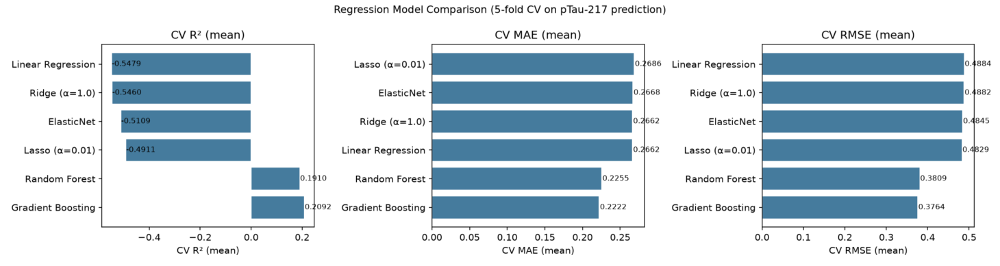

Models compared:

- Linear Regression
- Ridge
- Lasso
- ElasticNet
- Random Forest
- Gradient Boosting

### Cross-validated R²

| Model | CV R² |
|---|---:|
| Gradient Boosting | **0.209** |
| Random Forest | **0.191** |
| Lasso | −0.491 |
| ElasticNet | −0.511 |
| Ridge | −0.546 |
| Linear Regression | −0.548 |

### CV MAE

Lower is better. Gradient Boosting and Random Forest have lower error than the linear models.

### CV RMSE

Again lower is better. Gradient Boosting has the lowest reported CV RMSE (**0.376**).

### Interpretation

The tree-based models capture nonlinear patterns better than the linear models in this dataset. The best CV R² is still only about **0.21**, so pTau-217 remains far from fully explained by the included predictors.

---

## 9.4 Variance Inflation Factor (VIF)

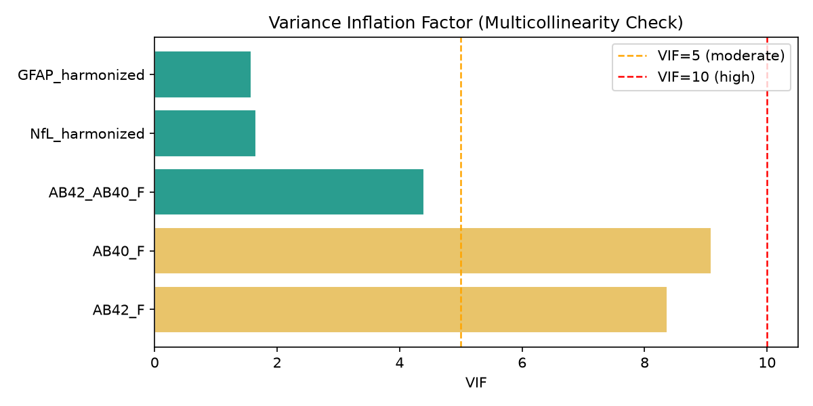

### What is VIF?

VIF measures how much a predictor overlaps with the information in the other predictors.

Common diagnostic guideposts shown in the figure:

- VIF ≈ 5 → moderate concern
- VIF ≈ 10 → high concern

Observed values:

| Predictor | VIF |
|---|---:|
| AB42_F | **8.37** |
| AB40_F | **9.09** |
| AB42/AB40 | 4.40 |
| NfL_harmonized | 1.65 |
| GFAP_harmonized | 1.58 |

The high AB42/AB40-related VIF values are understandable because the ratio itself is mathematically constructed from AB42 and AB40.

### Research implication

The regression coefficients for highly overlapping predictors should be interpreted cautiously. This does not invalidate the entire model; it means that assigning a unique independent effect to each correlated predictor is difficult.

---

## 9.5 Regression Results Table

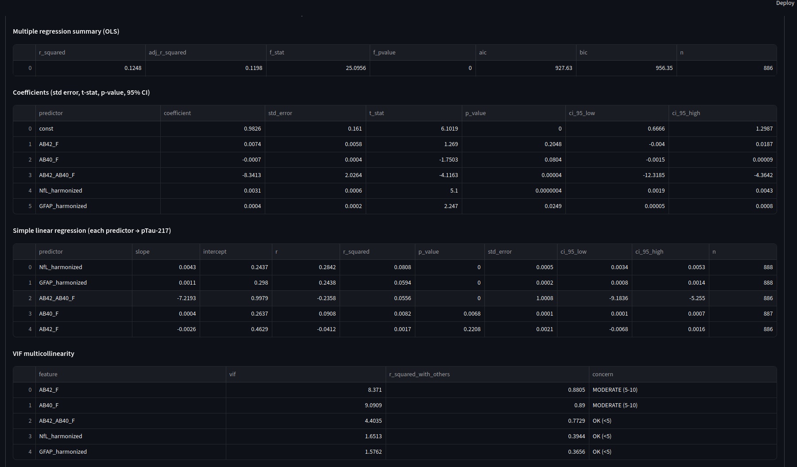

Final OLS summary:

- R² = **0.1248**
- Adjusted R² = **0.1198**
- F = **25.10**
- Overall model p < 0.001
- N = **886**

Significant predictors in the fitted multiple model:

- AB42/AB40: **p < 0.001**
- NfL_harmonized: **p < 0.001**
- GFAP_harmonized: **p = 0.0249**

Not statistically significant at the 0.05 level in the multiple model:

- AB42: **p = 0.2048**
- AB40: **p = 0.0804**

A correct interpretation is:

> The included predictors explain approximately 12.5% of the observed pTau-217 variance in this linear model.

It is **not** justified to say that the remaining 87.5% proves biological independence.

---

# 10. Feature Importance & PCA

## 10.1 SHAP Global Feature Importance

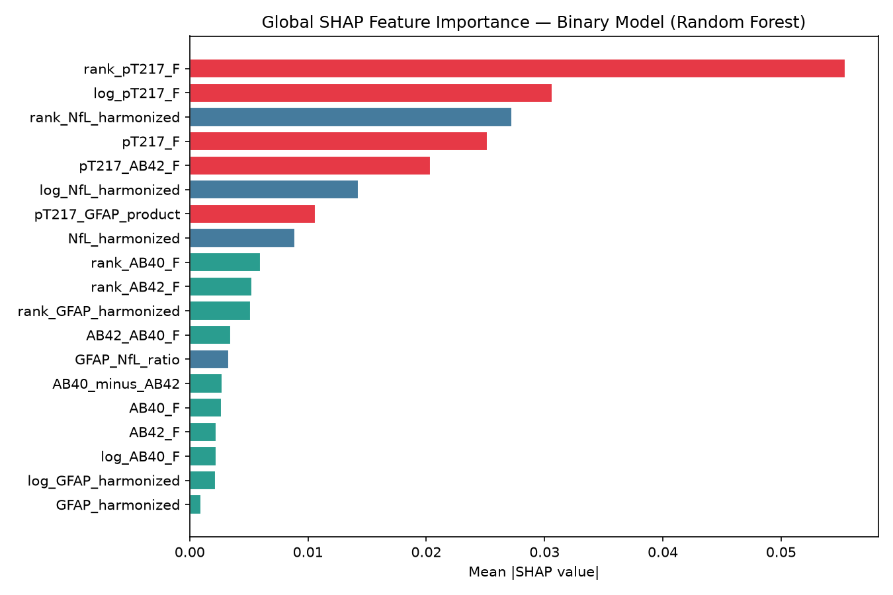

SHAP describes how much each feature contributes to model predictions on average.

Top features in the binary Random Forest include:

1. `rank_pT217_F`
2. `log_pT217_F`
3. `rank_NfL_harmonized`
4. `pT217_F`
5. `pT217_AB42_F`
6. `log_NfL_harmonized`
7. `pT217_GFAP_product`
8. `NfL_harmonized`

### Most important interpretation

The repeated presence of pTau-217 in raw, log-transformed, and rank-transformed forms means the model is repeatedly using the **same underlying pTau-217 signal in different representations**.

It should **not** be interpreted as three independent biological biomarkers.

---

## 10.2 Random Forest Built-in Importance

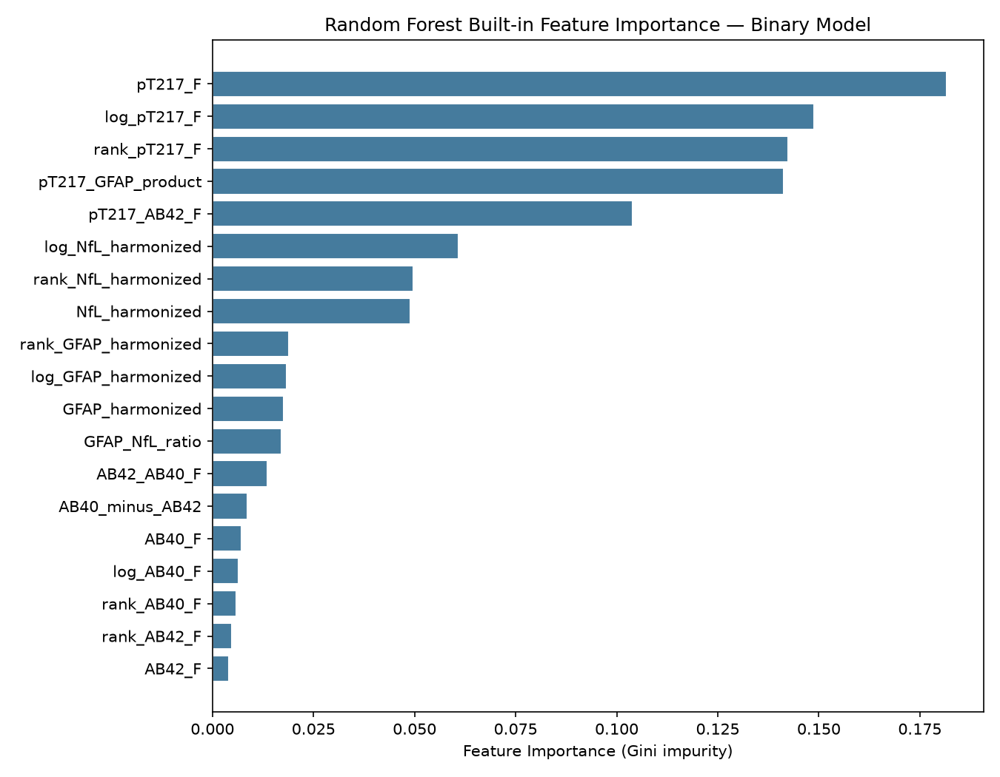

Random Forest Gini importance measures how useful features were for making tree splits.

Top features:

- pT217_F ≈ **0.182**
- log_pT217_F ≈ **0.149**
- rank_pT217_F ≈ **0.142**
- pT217_GFAP_product ≈ **0.141**
- pT217_AB42_F ≈ **0.104**

The SHAP and Gini views tell a similar high-level story: **pTau-217-derived signals dominate the binary model's feature usage**.

Again, model importance is not the same thing as causality.

---

## 10.3 PCA — Score Plot, Explained Variance, and Loadings

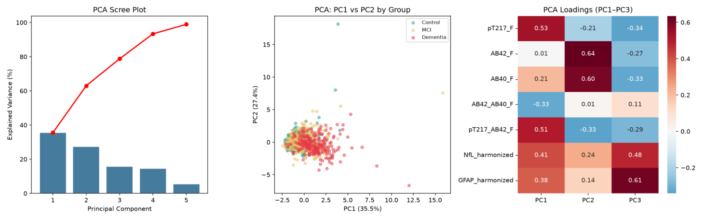

### What is PCA?

Principal Component Analysis summarizes many correlated measurements into a smaller set of combined axes called **principal components**.

A principal component is **not a new medical biomarker**. It is a mathematical combination of several original variables.

### Explained variance

- PC1 = **35.5%**
- PC2 = **27.4%**
- PC3 = **15.8%**
- PC4 = **14.6%**
- PC5 = **5.6%**

The first two explain about **63%**, and five components explain about **99%** of the standardized variance.

### Loadings

The loading matrix shows which biomarkers contribute strongly to each component. For example:

- PC1 receives strong positive contributions from pTau-217, pTau/AB42, NfL, and GFAP.
- PC2 is strongly influenced by AB42 and AB40.
- PC3 has strong contributions from GFAP and NfL.

### Score plot

The PC1-vs-PC2 patient plot shows **substantial overlap between diagnostic groups**, especially MCI. This is consistent with the difficulty of the 3-class classification task.

---

## 10.4 Pair Plot — Core Biomarkers by Diagnostic Group

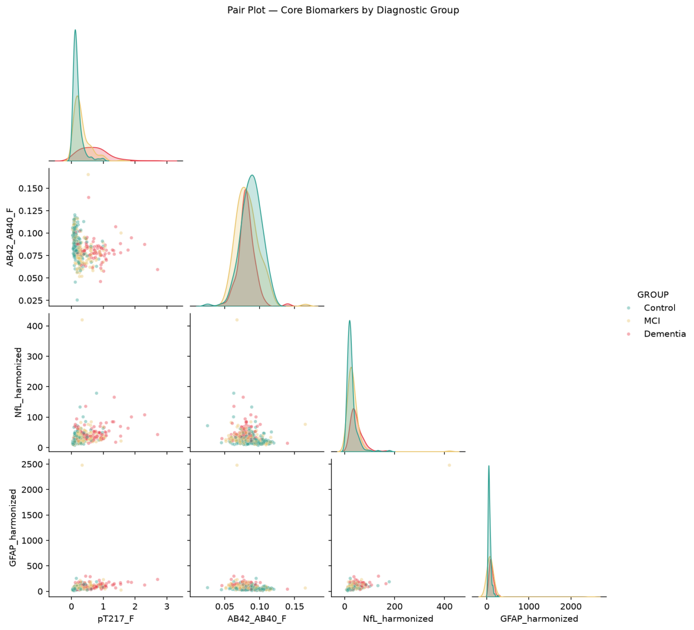

A pair plot combines two types of information:

- **Diagonal:** distribution of each biomarker
- **Off-diagonal:** relationship between pairs of biomarkers

The color indicates diagnostic group.

### What it shows

- pTau-217 has a visible shift toward higher values in Dementia.
- NfL and GFAP also show higher values in Dementia, but with considerable overlap.
- AB42/AB40 shows substantial group overlap but a lower tendency in Dementia.
- NfL and GFAP have long right tails and extreme observations.

The pair plot therefore provides a visual bridge between the distribution, correlation, and statistical-test sections.

---

# 11. Distributions & Outliers

## 11.1 Biomarker Histograms by Diagnostic Group

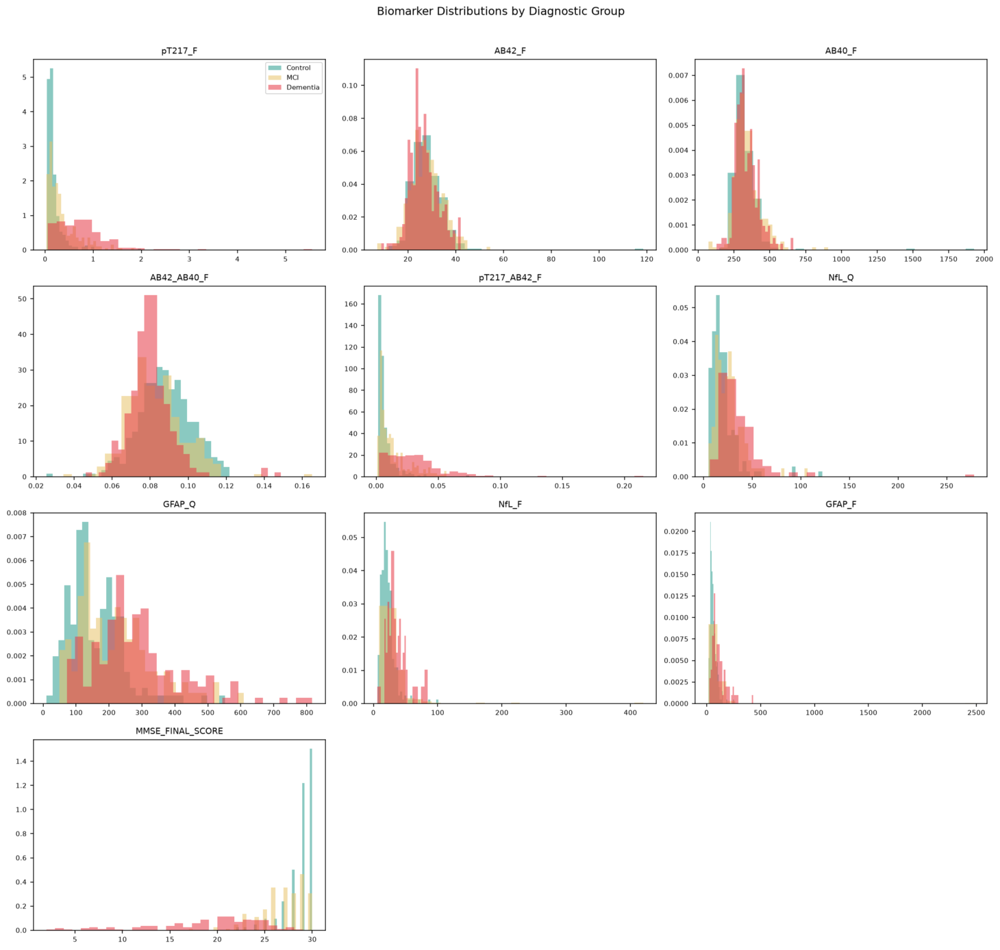

The histograms show the distribution of each variable in Control, MCI, and Dementia.

### Major patterns

- **pTau-217:** strong right shift toward Dementia
- **AB42:** large overlap across groups
- **AB40:** large overlap with some high values
- **AB42/AB40:** lower tendency in Dementia
- **pTau/AB42:** strong right shift in Dementia
- **NfL/GFAP:** higher values in Dementia plus long right tails

The descriptive analysis confirms strong right-skewness, particularly for NfL_F and GFAP_F.

---

## 11.2 Boxplots by Diagnostic Group

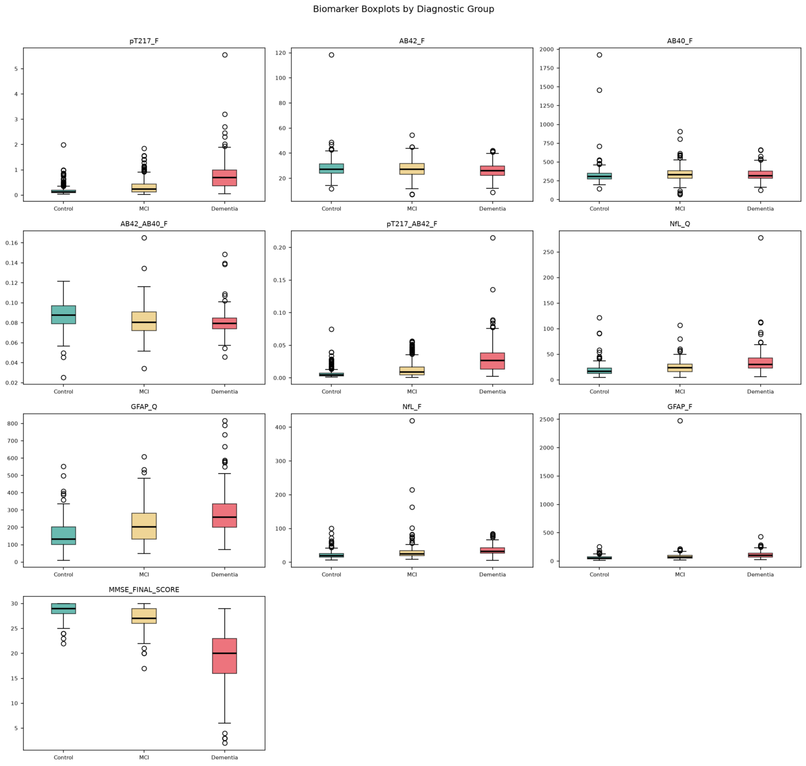

Boxplots provide:

- median
- interquartile range
- whiskers
- potential outliers

The figure visually confirms that pTau-217, NfL, and GFAP tend to be higher in Dementia, while AB42 and AB40 have greater overlap.

Important extreme values include approximately:

- pTau-217 maximum: **5.56 pg/mL**
- AB40 maximum: **1927 pg/mL**
- NfL_F maximum: **419.7 pg/mL**
- GFAP_F maximum: **2478.1 pg/mL**

---

## 11.3 Missing Value Percentage

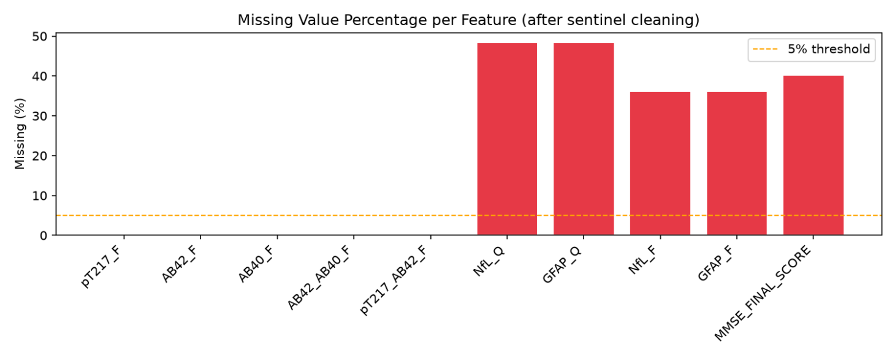

Missingness after generalized sentinel cleaning:

| Feature | Missing % |
|---|---:|
| pT217_F | 0.00% |
| AB42_F | 0.34% |
| AB40_F | 0.22% |
| AB42/AB40 | 0.34% |
| pT217/AB42 | 0.34% |
| NfL_Q | **48.48%** |
| GFAP_Q | **48.48%** |
| NfL_F | **36.11%** |
| GFAP_F | **36.11%** |
| MMSE | **40.16%** |

### Research meaning

The major missingness is not evenly distributed across variables. NfL and GFAP are strongly affected by assay-platform availability, while MMSE missingness varies by diagnostic group.

---

## 11.4 Missing Value Pattern

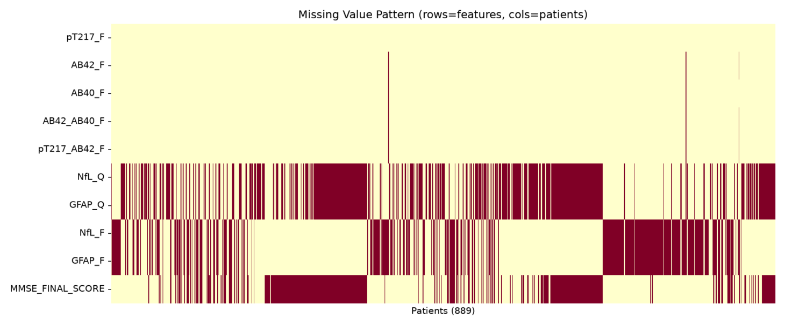

This heatmap has:

- rows = features
- columns = patients

The visible blocks show that missingness is **structured**, not simply random noise.

The similar patterns in NfL_Q/GFAP_Q and NfL_F/GFAP_F are consistent with platform availability. This is one reason the project performs cross-platform harmonization before modeling.

---

# 12. Outlier Analysis

## 12.1 IQR Outlier Percentages

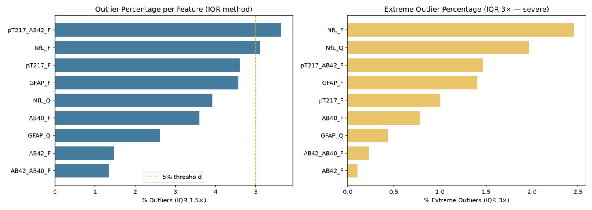

The standard IQR rule flags values outside approximately:

\[
Q1 - 1.5\times IQR
\]

and

\[
Q3 + 1.5\times IQR
\]

Selected observed IQR-outlier percentages include:

- pT217/AB42: about **5.6%**
- NfL_F: about **5.1%**
- pT217_F: about **4.6%**
- GFAP_F: about **4.6%**
- NfL_Q: about **3.9%**

The figure includes a 5% reference line.

---

## 12.2 Extreme Outliers — 3×IQR

The right panel of the same figure uses a stricter **3×IQR** rule to highlight severe/extreme observations.

NfL_F and NfL_Q show comparatively high extreme-outlier percentages, while GFAP_F also contains notable extreme observations.

### Important rule

**Flagged does not mean invalid.**

In biomedical data, extreme values can be genuine measurements from patients with severe disease or other legitimate sources of biological variability.

---

## 12.3 GFAP_F — Before vs After Extreme-Value Trimming

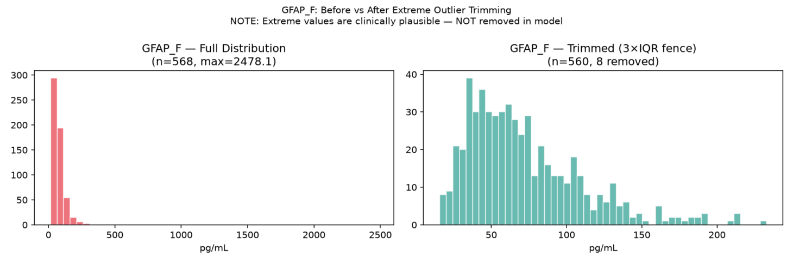

The left panel shows the complete GFAP_F distribution:

- n = **568**
- maximum = **2478.1 pg/mL**

The right panel temporarily removes eight observations beyond the 3×IQR fence so that the main body of the distribution can be visualized more clearly.

### Critical point

Those observations were **not removed from the actual model**.

The visualization is a diagnostic demonstration of how extreme values stretch the axis.

The finalized analysis retains the observations and uses robust preprocessing to reduce their disproportionate influence.

---

# 13. Integrated Research Interpretation

The figures together tell one coherent story:

### 13.1 pTau-217 is the clearest biomarker signal in this cohort

pTau-217 repeatedly appears as:

- the strongest biomarker-level association with diagnosis
- a large Control-vs-Dementia effect
- one of the largest fold changes
- a dominant feature in SHAP/Gini model importance
- a strong contributor to PCA structure

This convergence across independent analysis types is stronger evidence than relying on any one plot alone.

### 13.2 NfL and GFAP provide additional signal

NfL and GFAP both increase in the Dementia group and show positive relationships with diagnostic status. They also appear in feature importance and PCA loading analyses.

Their signals are not identical to pTau-217, which supports their use as complementary biomarkers rather than simple substitutes.

### 13.3 AB42 and AB40 are weaker individually

Raw AB42 and AB40 show substantial overlap between groups and smaller effect sizes. The AB42/AB40 ratio is more informative than the raw AB42 value in this dataset.

### 13.4 MCI is the difficult diagnostic boundary

The binary Control-vs-Dementia model shows much stronger separation than the 3-class task. In the 3-class test set, MCI recall is only **38.3%**, and the PCA score plot also shows substantial overlap.

### 13.5 Cohort and platform structure matter

PHASE and diagnosis are strongly associated (Cramér's V ≈ **0.37**), while NfL/GFAP availability depends strongly on assay platform. The project therefore excludes phase/platform-count shortcuts and harmonizes assay measurements.

### 13.6 The biomarker distributions are not simple Gaussian data

The biomarkers are heavily right-skewed. This explains why:

- non-parametric statistical tests were preferred for group comparisons
- log transformations are used in modeling
- ordinary linear regression assumptions are violated
- tree-based regression models perform better than simple linear models

---

# 14. Statistical and Clinical Interpretation Rules

These rules should be preserved in future papers, presentations, and documentation.

### Rule 1 — Correlation is not causation

A positive pTau/diagnosis correlation does not prove that pTau causes Dementia.

### Rule 2 — Statistical significance is not clinical importance

A very small p-value can occur with a small effect. Always inspect effect size and group distributions.

### Rule 3 — AUC is not accuracy

ROC-AUC of 0.956 does **not** mean 95.6% accuracy. The actual binary test accuracy is 87.4%.

### Rule 4 — Feature importance is not causal importance

SHAP/Gini tells us how the model uses a feature, not whether the biomarker causes disease.

### Rule 5 — Derived variables are not independent measurements

pTau217/AB42 contains pTau-217; pTau raw/log/rank are multiple transformations of the same underlying measurement.

### Rule 6 — Outlier ≠ error

Extreme biomarker values can be biologically plausible. The project therefore retains them rather than deleting them automatically.

### Rule 7 — Missing ≠ negative

An unavailable assay result is not a low biomarker value. Missingness can itself have structural causes.

### Rule 8 — MMSE is different from plasma biomarkers

MMSE is a clinical cognitive assessment and is excluded from the primary biomarker-only classifier because it is closely connected to the diagnostic workflow.

---

# 15. Recommended Short Explanation for a Medical Audience

> **“We evaluated the plasma biomarker dataset from multiple complementary perspectives. First, we examined distributions, missingness, and outliers to understand data quality. We then used correlation and non-parametric statistical testing to identify relationships between biomarkers and diagnostic groups. pTau-217 consistently showed the strongest group-level signal, while NfL and GFAP provided complementary information. We next evaluated classification performance using ROC, precision-recall curves, confusion matrices, threshold analysis, and calibration. The binary Control-versus-Dementia model performed substantially better than the three-class model, mainly because MCI was difficult to distinguish from the neighboring diagnostic categories. Finally, SHAP, Random Forest feature importance, PCA, and regression were used to understand how the biomarkers contribute to the model and how the underlying biomarker structure behaves. The findings support strong within-cohort discrimination for the binary task, but external validation and prospective clinical evaluation remain necessary.”

---

# 16. Reproducibility

The visual analysis is generated from the project's existing analysis pipeline:

```bash
cd /home/ambivert/Downloads/adni_project
python3 run_analysis.py
```

The finalized analysis pipeline writes results to:

```text
results/
├── statistics/
├── correlations/
├── regression/
├── classification/
├── feature_analysis/
├── distributions/
├── outliers/
├── model_comparison/
└── reports/
```

The analysis run generates **101 result files** in the current finalized project.

---

# 17. Source Documents in the Project

This visual guide should be read together with:

- `README.md`
- `docs/DOCUMENTATION.md`
- `results/reports/ANALYSIS_REPORT.md`
- `results/reports/analysis_summary.json`
- `run_analysis.py`
- `requirements.txt`
- `reports/ADNI_AD_Classifier_Report.docx`

The **latest `ANALYSIS_REPORT.md`** should be treated as the primary source for finalized statistical values.

---

# 18. Final Research Takeaway

The analysis is strongest when the figures are considered together rather than individually:

> **pTau-217 provides the clearest plasma-biomarker signal for separating Control and Dementia in this ADNI cohort. NfL and GFAP add complementary information, while raw AB42 and AB40 show weaker individual separation. The binary classifier demonstrates strong held-out discrimination, whereas the three-class problem remains difficult because MCI overlaps substantially with Control and Dementia. The dataset also contains structured assay-platform missingness, substantial right-skewness, extreme but potentially valid biomarker values, and phase-diagnosis confounding that must be acknowledged in research interpretation.**

These results describe the behavior of the analyzed ADNI data and models. They should not be presented as evidence of causal relationships or as independent clinical validation outside the cohort.

---

## Image directory

All visualizations referenced by this document are stored in `images/` with descriptive filenames so the folder can be pushed directly to GitHub.

---

# 19. Additional Figures from Original Analysis Pipeline

The following figures were generated during the original model development pipeline (`notebooks/`) and complement the statistical analysis figures above.

---

## 19.1 Target Class Distribution

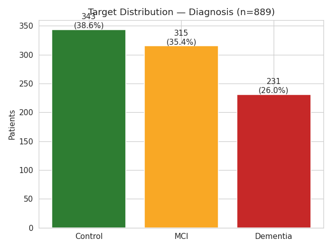

Shows the 3-class distribution (Control=343, MCI=315, Dementia=231) and confirms mild imbalance (1.48:1 max ratio). This is the starting point for understanding the dataset composition.

---

## 19.2 Biomarker Violin Plots by Group

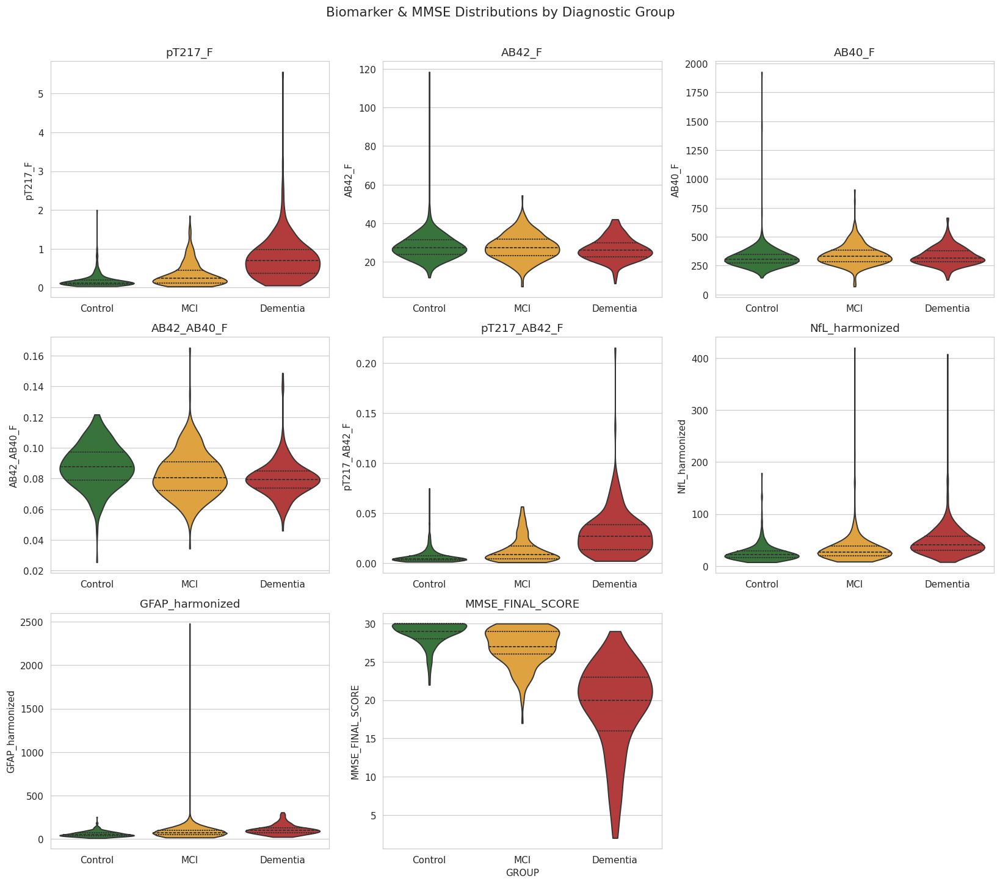

Violin plots show the full distribution shape (not just quartiles) for each biomarker across the three diagnostic groups. The wide right tails for pTau-217, NfL, and GFAP in the Dementia group are clearly visible.

---

## 19.3 Log-Transformed Biomarker Boxplots

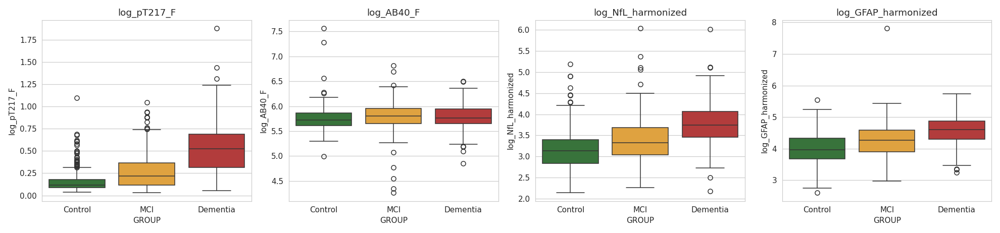

After log1p transformation, the distributions become more symmetric. This justifies the use of log transforms in the modeling pipeline and shows that the transformation meaningfully reduces skewness.

---

## 19.4 Phase × Group Confound

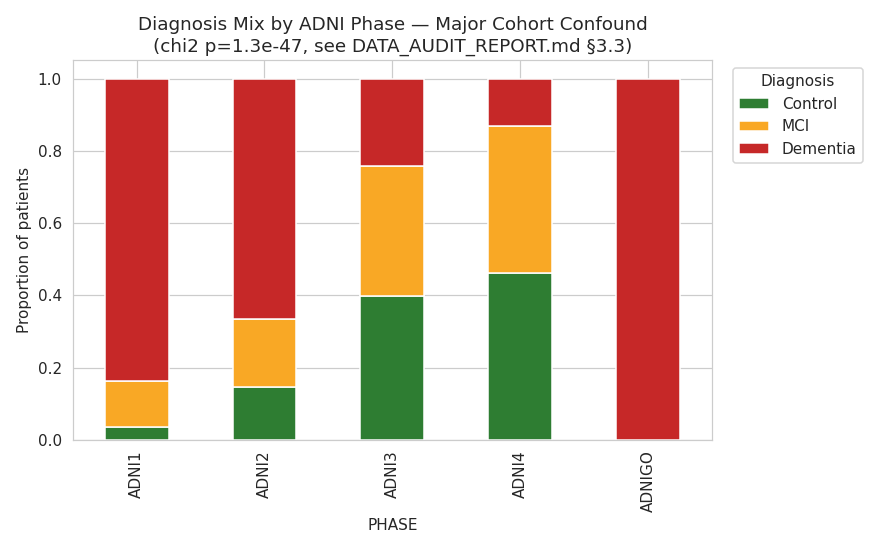

Visualizes the strong association between ADNI phase and diagnostic group (χ²=241.2, Cramér's V=0.37, p=1.3×10⁻⁴⁷). Early phases (ADNI1, ADNI2) are dominated by Dementia; ADNI4 (64% of data) skews toward Control/MCI. This is the most critical data quality finding and the reason PHASE is excluded from all models.

---

## 19.5 Assay Platform Agreement

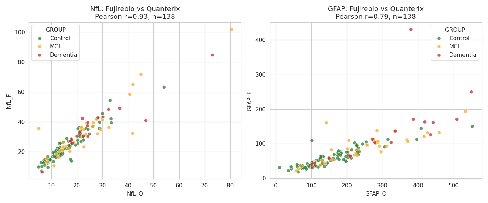

For the 138 patients with both Fujirebio and Quanterix measurements, this figure shows the cross-platform correlation. NfL: Pearson r=0.934, ratio=1.465×. GFAP: Pearson r=0.793, ratio=0.376×. The stable, group-invariant ratio licenses principled harmonization.

---

## 19.6 Mutual Information

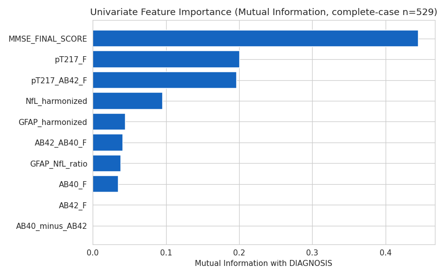

Mutual information measures non-linear statistical dependence between each feature and the diagnosis target. Complements the Spearman correlation ranking and confirms pTau-217 as the dominant signal.

---

## 19.7 Bootstrap Confidence Intervals

### 3-Class Model

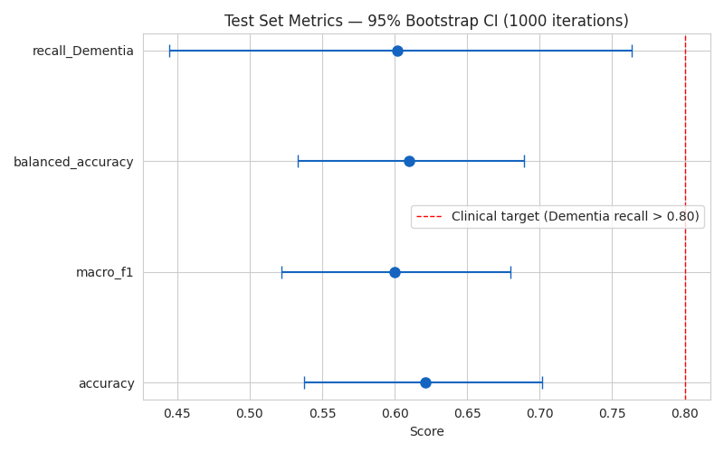

### Binary Model

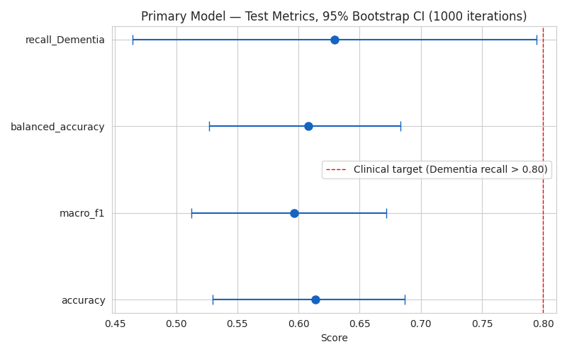

Bootstrap CIs (1000 resamples) for key metrics. The wide intervals reflect the modest test set sizes (87 binary, 134 three-class). Every prediction output in the app includes these intervals so uncertainty is always visible.

---

## 19.8 Threshold Trade-off (3-Class Model)

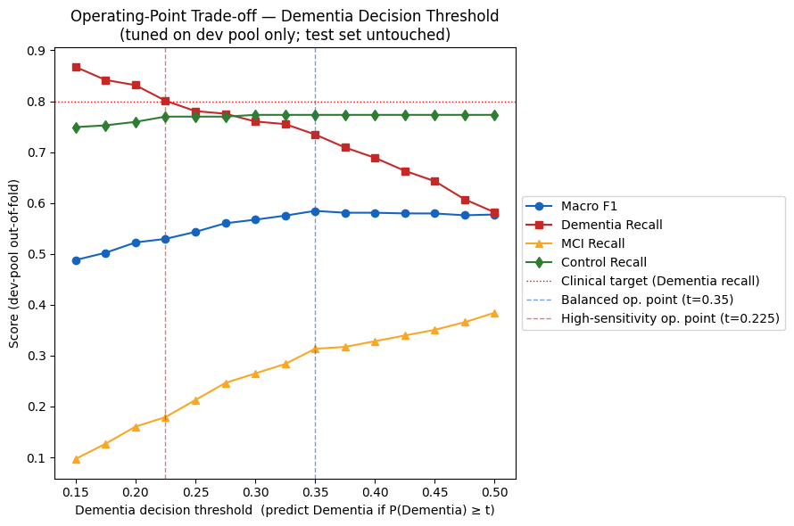

Shows the Dementia recall vs. precision trade-off across thresholds for the 3-class model. At the high-sensitivity threshold (P(Dementia)≥0.225), Dementia recall reaches ~82.9% at the cost of increased false positives.

---

## 19.9 SHAP Summary Plots (Per-Class)

### Control class

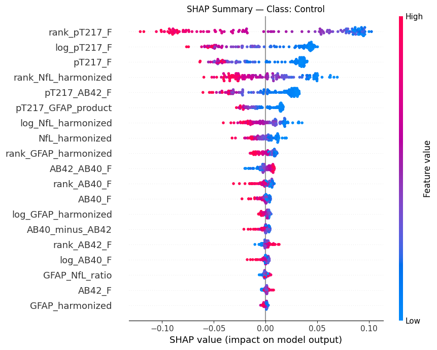

### MCI class

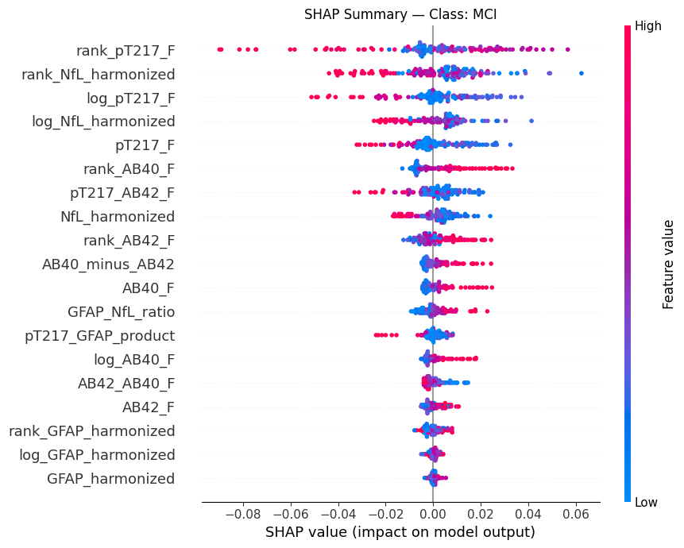

### Dementia class

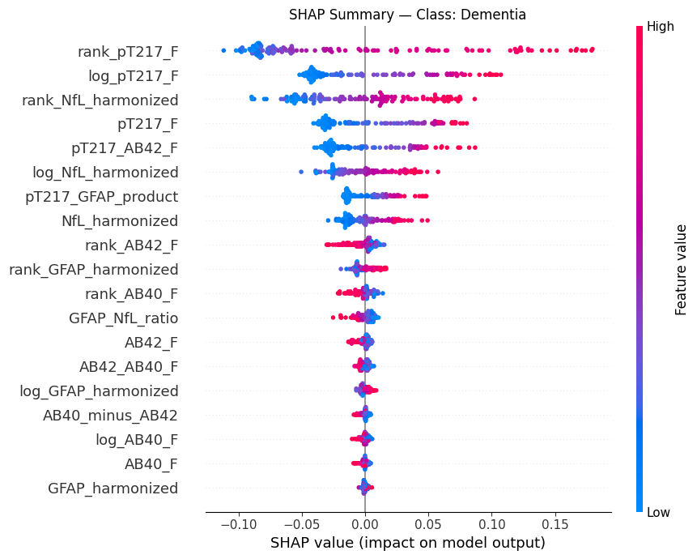

Per-class SHAP summary plots show how each feature pushes predictions toward or away from each class. Red = high feature value, blue = low. For the Dementia class, high pTau-217 (red) strongly increases the Dementia prediction.

---

## 19.10 SHAP Global Importance (Original Pipeline)

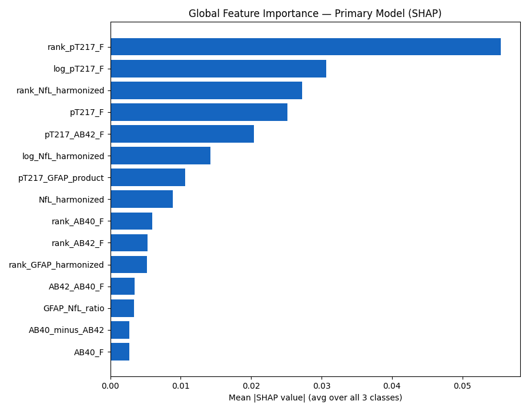

The original SHAP global importance from the development pipeline. Consistent with the statistical analysis results: pTau-217 in three forms (raw, log, rank) dominates.

---

## 19.11 SHAP Dependence Plots

### pTau-217 (rank transform) vs Dementia

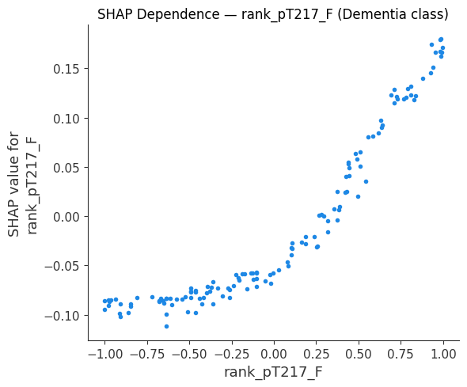

### pTau-217 (log transform) vs Dementia

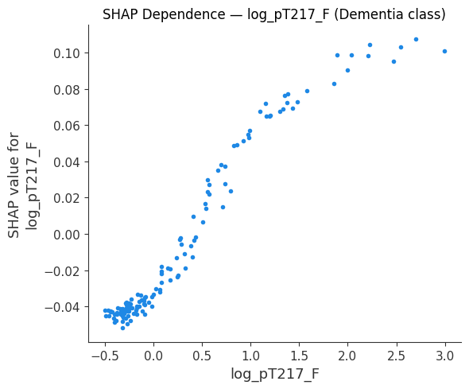

### NfL (rank transform) vs Dementia


Dependence plots show how SHAP values change as a feature value increases. The monotonic increase in SHAP value with pTau-217 rank confirms it is the primary driver of Dementia predictions.

---

## 19.12 SHAP Waterfall Plots (Individual Patient Examples)

### Correctly predicted Control


### Correctly predicted Dementia


### False positive (Control predicted as Dementia)


The false positive patient has elevated pTau-217 (0.83 pg/mL) — consistent with preclinical/prodromal AD where biomarker positivity precedes clinical symptom onset.

### Missed Dementia (predicted Control)


The missed Dementia patient has low pTau-217 (~0.35 pg/mL, about 1/3 of typical Dementia) but elevated NfL — consistent with non-amyloid/non-tau pathology.

### Missed Dementia (predicted MCI, 3-class model)


In the 3-class model, some Dementia patients are predicted as MCI rather than Control, reflecting the ambiguous boundary between these categories.

---

## Image directory

All visualizations referenced by this document are stored in `images/` with descriptive filenames so the folder can be pushed directly to GitHub.

**Total images: 57** (36 from original pipeline + 21 from statistical analysis pipeline)

